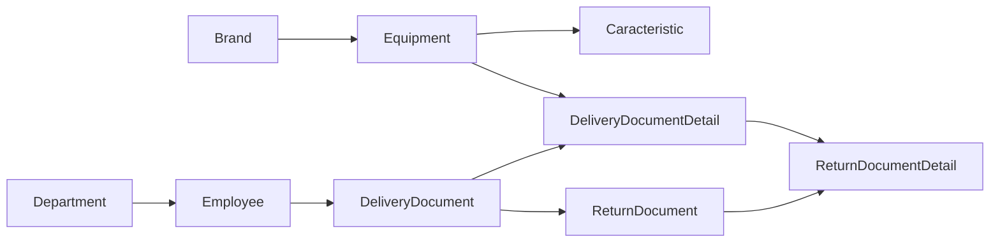
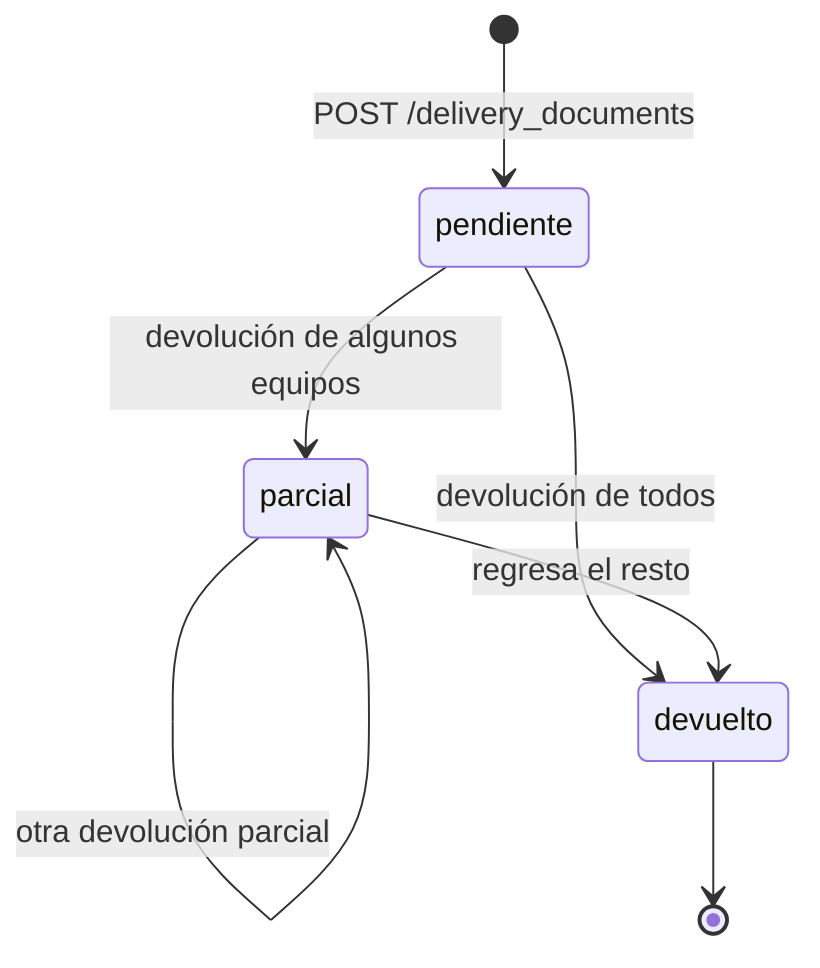
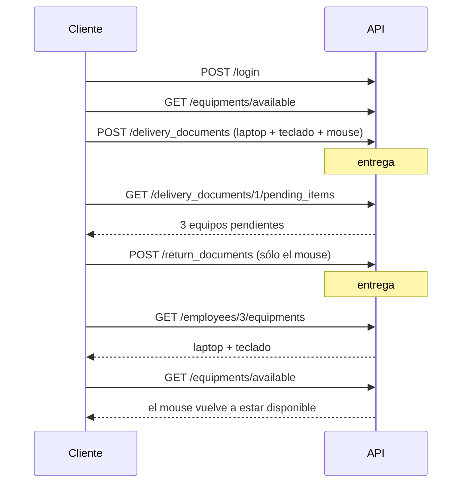

# Flujo de trabajo de la API — Asignación de equipos TIC

Este documento describe **en qué orden se usan los endpoints** para cubrir el
proceso completo: dar de alta el catálogo, entregar equipo a un empleado y
registrar su devolución (total o parcial).

Todas las rutas cuelgan de `/api`, devuelven la envoltura
`{statusCode, message, data}` y exigen `Authorization: Bearer <token>`.
La documentación interactiva vive en `/api/documentation`.

---

## 1. Modelo del proceso



| Entidad | Qué guarda |
|---|---|
| `Brand` + `Equipment` | El equipo concreto: `TECLADO - DELL`, con modelo y serie. |
| `Caracteristic` | Especificaciones del equipo (RAM, procesador, IMEI…). Sólo tienen sentido en equipos como laptop, desktop, teléfono o impresora. |
| `Department` + `Employee` | A quién se le puede asignar equipo. |
| `DeliveryDocument` | Encabezado de la **entrega**: planta, empleado, fecha, firmas y quién la registró. |
| `DeliveryDocumentDetail` | Un equipo dentro de esa entrega. **Es la unidad que se devuelve.** |
| `ReturnDocument` | Encabezado de la **devolución**, siempre ligado a una entrega. |
| `ReturnDocumentDetail` | Un equipo devuelto; apunta al `DeliveryDocumentDetail` original. |

**Regla estructural del dominio:** sin entrega no puede haber devolución. Un
equipo está *asignado* mientras exista un `DeliveryDocumentDetail` suyo **sin**
su `ReturnDocumentDetail`.

---

## 2. Estados de una entrega

El campo `status` de `DeliveryDocument` se calcula sobre sus detalles; no se
guarda en la base:

| Estado | Significado |
|---|---|
| `pendiente` | Ningún equipo devuelto. |
| `parcial` | Se devolvió parte del equipo (el caso "sólo regresó el mouse"). |
| `devuelto` | Todos los equipos regresaron. |

En los listados existe además el filtro `status=activo` = `pendiente` +
`parcial`, es decir, entregas con equipo todavía en poder del empleado.



---

## 3. Fase 0 — Autenticación

| Paso | Endpoint |
|---|---|
| Iniciar sesión | `POST /api/login` |
| Verificar sesión | `GET /api/check-status` |
| Crear usuarios (sólo admin) | `POST /api/register` |

El token se manda en todas las llamadas siguientes. `user_id` de entregas y
devoluciones **sale del token**, nunca del cuerpo.

---

## 4. Fase 1 — Catálogos (una sola vez, luego mantenimiento)

| Paso | Endpoint | Nota |
|---|---|---|
| 1 | `POST /api/brands` | `DELL`, `HP`, `LOGITECH`… |
| 2 | `POST /api/equipments` | Requiere `brand_id` y `type` (enum: `mouse`, `keyboard`, `laptop`, `desktop`, `printer`, `monitor`, `headset`, `webcam`, `charger`, `cable`, `adapter`, `other`). `registerdBy` lo pone el token. |
| 3 | `POST /api/caracteristics` | Especificaciones del equipo (`equipment_id`). Consulta con `GET /api/caracteristics?equipmentId=1`. |
| 4 | `POST /api/departments` | |
| 5 | `POST /api/employees` | Requiere `department_id`. |

---

## 5. Fase 2 — Entrega de equipo

### 5.1 Armar la entrega

```http
GET /api/employees                        # elegir al empleado
GET /api/equipments/available?type=mouse  # sólo equipo sin entrega activa
```

`GET /api/equipments/available` es el endpoint clave del formulario de entrega:
excluye todo lo que ya está en manos de alguien. Acepta `type` y `search`
(busca en nombre, modelo y serie).

### 5.2 Registrar la entrega

`POST /api/delivery_documents` — **`multipart/form-data`**, crea encabezado y
detalle en una sola transacción:

```
location=1                                  # 1 = Planta Tejar, otro = Planta Parramos
employee_id=3
observations=Entrega inicial de equipo
responsable_signature=<archivo png/jpg>     # firma de quien recibe
administrador_signature=<archivo png/jpg>   # firma de quien entrega
items[0][equipment_id]=1
items[0][observations]=Se entrega sin cargador
items[1][equipment_id]=2
```

- `delivery_date` y `user_id` los pone el servidor.
- Las firmas se guardan en el disco `public`, carpeta `signatures/`, con nombre
  uuid; en las respuestas viaja **la ruta relativa**, no la URL (requiere
  `php artisan storage:link` para servirlas).
- La respuesta es `data: true`; el documento se lee después con
  `GET /api/delivery_documents/{id}`.

### 5.3 Consultar entregas

```http
GET /api/delivery_documents                              # todas
GET /api/delivery_documents?employeeId=3&status=activo   # lo que trae encima un empleado
GET /api/delivery_documents/{id}                         # con items, status y conteos
GET /api/employees/{id}/equipments                       # equipos vigentes del empleado
GET /api/equipments/{id}/history                         # quién ha tenido el equipo
```

### 5.4 Correcciones sobre una entrega ya firmada

| Acción | Endpoint | Qué acepta |
|---|---|---|
| Corregir encabezado | `PUT /api/delivery_documents/{id}` | `location`, `observations` |
| Corregir un equipo | `PUT /api/delivery_document_details/{id}` | `observations` |
| Agregar un equipo | `POST /api/delivery_document_details` | `delivery_document_id`, `equipment_id`, `observations` |
| Quitar un equipo | `DELETE /api/delivery_document_details/{id}` | — |
| Anular la entrega | `DELETE /api/delivery_documents/{id}` | Borra detalles en cascada |

Firmas, fechas, empleado y usuario **no se modifican**: son la parte firmada del
documento.

---

## 6. Fase 3 — Devolución (total o parcial)

### 6.1 Saber qué falta por devolver

```http
GET /api/delivery_documents/{id}/pending_items
```

Devuelve los detalles de esa entrega que **todavía no tienen devolución**. El
`id` de cada elemento es el `delivery_document_detail_id` que se envía después.

### 6.2 Registrar la devolución

`POST /api/return_documents` — **`multipart/form-data`**, encabezado y detalle en
una transacción:

```
delivery_document_id=1
observations=Devuelve únicamente el mouse
responsable_signature=<archivo png/jpg>
administrador_signature=<archivo png/jpg>
items[0][delivery_document_detail_id]=2
items[0][observations]=Regresa en buen estado
```

- **Devolución parcial:** se mandan sólo los detalles que regresan. Los demás
  siguen asignados y la entrega queda en `parcial`.
- **Devolución total:** se mandan todos los pendientes; la entrega pasa a
  `devuelto`.
- Una entrega puede tener **varias devoluciones** (una por cada regreso
  parcial).
- `return_date` y `user_id` los pone el servidor. La respuesta es `data: true`.

### 6.3 Consultar devoluciones

```http
GET /api/return_documents                              # todas
GET /api/return_documents?deliveryDocumentId=1         # las de una entrega
GET /api/return_documents?employeeId=3                 # las de un empleado
GET /api/return_documents/{id}                         # con items y estado de la entrega
GET /api/return_document_details?returnDocumentId=1
```

### 6.4 Correcciones sobre una devolución

| Acción | Endpoint |
|---|---|
| Corregir observaciones del documento | `PUT /api/return_documents/{id}` |
| Corregir observaciones de un equipo | `PUT /api/return_document_details/{id}` |
| Agregar un equipo devuelto | `POST /api/return_document_details` |

---

## 7. Secuencia completa (ejemplo del caso parcial)



---

## 8. Mapa de endpoints del proceso

| Método | Ruta | Uso en el flujo |
|---|---|---|
| GET | `/api/equipments` | Inventario completo (incluye `isAssigned`). |
| GET | `/api/equipments/available` | Equipo asignable (filtros `type`, `search`). |
| GET | `/api/equipments/{id}/history` | Historial de asignaciones del equipo. |
| GET | `/api/employees/{id}/equipments` | Equipo vigente de un empleado. |
| POST | `/api/delivery_documents` | Registrar entrega con sus equipos. |
| GET | `/api/delivery_documents` | Listar entregas (`employeeId`, `location`, `status`). |
| GET | `/api/delivery_documents/{id}` | Entrega con `items`, `status` y conteos. |
| GET | `/api/delivery_documents/{id}/pending_items` | Base de la devolución parcial. |
| PUT | `/api/delivery_documents/{id}` | Corregir planta y observaciones. |
| DELETE | `/api/delivery_documents/{id}` | Anular entrega (cascada). |
| GET/POST/PUT/DELETE | `/api/delivery_document_details[/{id}]` | Mantener los equipos de una entrega (`deliveryDocumentId`, `equipmentId`, `pending`). |
| POST | `/api/return_documents` | Registrar devolución total o parcial. |
| GET | `/api/return_documents[/{id}]` | Consultar devoluciones (`deliveryDocumentId`, `employeeId`). |
| PUT | `/api/return_documents/{id}` | Corregir observaciones. |
| GET/POST/PUT | `/api/return_document_details[/{id}]` | Mantener los equipos de una devolución (`returnDocumentId`). |

---

## 9. Errores que devuelve el proceso

| Código | Cuándo |
|---|---|
| `401` | Token ausente, inválido o expirado. |
| `403` | Ruta que exige rol `admin` sin tenerlo. |
| `404` | `NotFoundError`: el documento, equipo o empleado no existe. |
| `422` | Falla la validación del FormRequest (mensajes en español). |
| `400` | `BadRequestError`: la firma no se pudo guardar (formato o tamaño). |
| `406` | `NotAcceptable`: reservado para reglas de negocio (ver `reglas.md`). |
| `500` | Error inesperado. |

---

## 10. Lo que este flujo **todavía no valida**

Los endpoints cubren el proceso, pero las reglas de negocio (no asignar dos
equipos del mismo tipo al mismo empleado, no entregar equipo ya asignado, no
devolver dos veces el mismo equipo, etc.) **no están implementadas**. Están
descritas, con el código propuesto, en [`reglas.md`](reglas.md).
